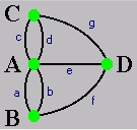
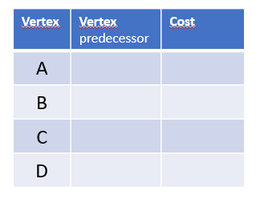
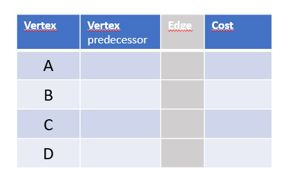

# ADT Graph

This repository consists of an IntelliJ project to support the teaching of abstract data types in the Java language, in the context of the Advanced Programming course unit - ESTSetúbal.

The requested exercises are the following:

## Exercise 1.1


EThis project contains integrated the api ADT_Graph.jar that provides an implementation of ADT Graph.
The goal is to manipulate the ADT Graph. To do this we define a graph using objects of the `Local` type for vertices and objects of the `Bridge` type for edges.

1. Complete the `main' method in order to:
    1. Construct the graph shown in the figure;
    2. Show all the bridges leaving from the Place `A`;
    3. Show all neighbouring locations of Site `D`;
    4. Determine the number of bridges leaving from `C`;
    5. Given two locations, check if there is a bridge that connects them directly.

Translated with www.DeepL.com/Translator (free version)


## Exercise 1.2

Recalling the pseudocode of DFS algorithm

```pascal

    Algorithm: DFS(Graph,vertice_root)
    BEGIN
        setAsVisited(vertice_root)
        push(s,vertice_root)
        WHILE s is not EMPTY
            BEGIN
                v <- pop(s)     
                process(v)
                FOR EACH w adjacents(v)
                    IF w is not visited THEN
                        BEGIN
                            setAsVisited(w)
                            push(s,w)
                        END
            END                    
    END

```

Make a method in the `TadGraphMain` class that implements the DFS method.

**Note: Use the `java.util.Stack` class to create the required stack instance.


## Exercise 2.1


We want to use the presented Dijktra algorithm to calculate the shortest path between two points in the graph below, assuming the following costs for traversing the edges:


    (a - 2)  (b - 1)  (c - 3) (d - 1) (g - 4) (f - 4) (e - 15) 
  
1. Fill in the table showing the result of applying Dijsktra's algorithm, starting from `Location A`.



- Consult the table constructed in the previous point to determine:
    - Lowest cost path to get from A to D ?
    - What is the cost ?

      **Note: How to know which bridge is crossed if `a` or `b`?

2. In order to know which bridge has been crossed between two locations (since there are parallel edges), we want to modify the above algorithm so that it records not only the list of locations crossed, **but also the edges crossed**.

* Fill in this new table, which shows the result of applying Dijsktra's algorithm, starting at `Location A`. Note that it contains one more column.



- Referring to the table constructed in the previous point determine:
    - The sequence of bridges travelled to get from A to D at least cost.
    - The sequence of bridges travelled to get from B to C at the lowest cost.

</small>

----

## Exercise 2.2 

Dijkstra's algorithm will be implemented on a concrete instance of TAD Graph, having as objective to calculate the least cost path between two points of the *Konisberg* map.


- Vertices are instantiated by the `Local` class;
- Edges are instantiated by the `Bridge` class (represents bridges);
- Each instance of Bridge will have an associated cost.

1. Implement into `TadGraphMain` the method:

 ```java
 public int minimumCostPath(Vertex<Local> orig, Vertex<Local> dst, List<Vertex<Local>> localsPath)
 ```
which, starting from the Origin vertex and the Destination vertex, calculates the shortest path.
use Dijkstra method.
 ```java
 /** * Performs the Dijkstra algorithm starting from 'orig'
     * @param orig the initial vertex
     * @param costs minimum cost from 'orig' to all the other vertex
     * @param predecessors predecessors along the paths
     */
    private void dijkstra(Vertex<Local> orig,
                          Map<Vertex<Local>, Double> costs,
                          Map<Vertex<Local>, Vertex<Local>> predecessors)`
 ```

2. Modify the main method to create the *Konisberg* map with the following values associated with the bridges:

  (a - 2)  (b - 1)  (c - 3) (d - 1) (g - 4) (f - 4) (e - 15) 

3. Show the use of the algorithm to:
- Determine the least cost path between:
    - Location B and Location C
    - Location A and location D

4. Create another variant of the minimumCostPath method in order to calculate the sequence of bridges that includes the shortest path.


 ```java
 public int minimumCostPath(Vertex<Local> orig, Vertex<Local> dst, 
                            List<Vertex<Local>> localsPath, 
                            List<Edge<Bridge,Local>> bridgePath)
 ```
note that the sequence of bridges that make up the path will be "returned" via the `List<Edge<Bridge,Local>> bridgePath` input parameter 
  You should implement the following method: 
 ```java
 private void dijkstra(Vertex<Local> orig,
                       Map<Vertex<Local>, Double> costs,
                       Map<Vertex<Local>, Vertex<Local>> predecessors
                       Map<Vertex<Local>, Edge<Bridge,Local>> edges)`
 ```
the  parameter `Map<Vertex<Local>,Edge<Bridge,Local>> edges` will contain the information on which edge (value) to traverse, given a vertex (key).

Test in main class  `TadGraphMain`, the new methods.
